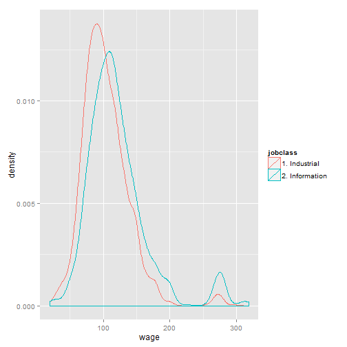

Exploration of Wage
========================================================
author: Xiaojing HU
date: Sat Jun 20 21:47:16 2015
transition: fade
transition-speed: slow

About the Shiny Application
========================================================

The application uses *Wage dataset* in library ISLR for you to explore the relationship between wage and other variables.  

There is a plot about the distribution of wage, with the mean in red line, on the top of webage.   
The default value of the *wage slidebar* on the left is the median of wage. You can move the slidebar to see the value in plot (blue line).


Plot Type
========================================================
The main part is **three types** of plotting:

1. *Pairs*: Comparing wage with other three variables at once.
- *Points*: Relationship between wage and one selected variable grouped by another selected variable.
- *Density*: Wage density grouped by one selected variable.

Parameters for plotting
========================================================

***
Select **Parameters for plotting** to explore the relationship. Parameters are variables in Wage dataset:
- X is used in all three types of plots
- Y and Z are used in Pairs plot
- Color for facet is used in Points and Density plots.

Plot Example
========================================================
left: 40%
- Density Plot 
- grouped by jobclass

```r
library(ggplot2)
library(ISLR)
data(Wage)
qplot(wage, color=jobclass, data=Wage, geom="density")
```

***
 
